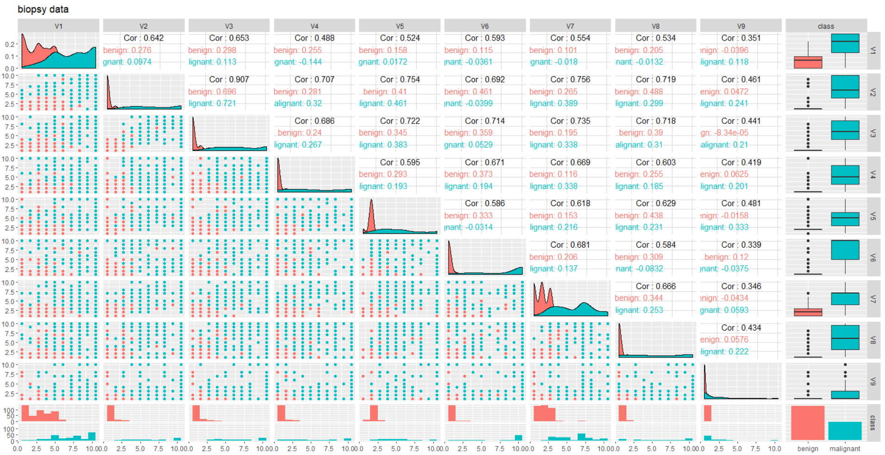
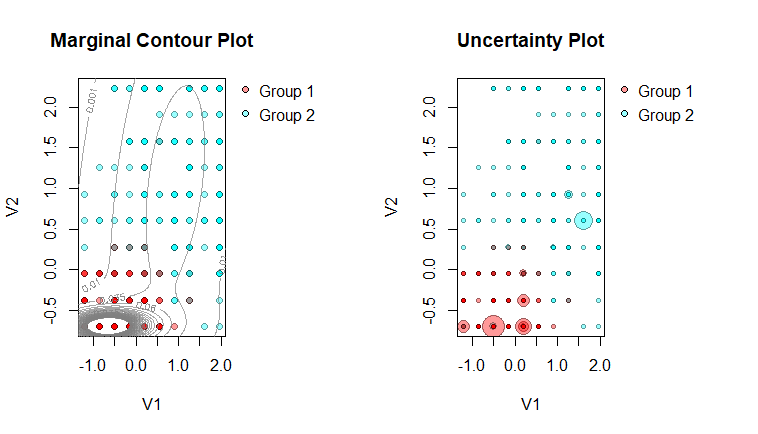

# Introduction 

## Data Description

The data set has been used in this analysis is called "biopsy", where it can be found at "**MASS**" which is a **R** package. It is a breast cancer data was recorded by Dr. William H. Wolberg who worked at University of Wisconsin Hospitals. The data contained information from biopsies of breast tumours for 699 patients with 11 variables in total, one is "ID", one is "class" which is response variable, and the other nine attributes are numerical variables which has been scaled of 1 to 10. This whole data is not complete, there are few missing value, so I take them off from the original data, also I take "ID" off since it's patients' ID number which plays no role in this analysis. Then, the data set left as a whole complete data set which contain 683 observations with ten variables, nine of them are predictor variables, V1 is clump thickness, V2 is uniformity of cell size, V3 is uniformity of cell shape, V4 is marginal adhesion, V5 is single epithelial cell size, V6 is bare nuclei, V7 is bland chromatin, V8 is normal nucleoli. V9 is mitoses, again, V1 to V9 are scaled to range from 1 to 10. And the other one is binary response variable called "class" with 2 levels "benign" and "malignant", 444 observations are "benign" class, the rest 239 observations are "malignant" class.  \par

```{r echo=FALSE, message=FALSE, warning=FALSE,results='hide'}

library(tree)

library(tidyverse)
library(MASS)
library(skimr)
library(GGally)
library(e1071)
library(randomForest)
library(gbm)
library(teigen)
library(knitr)

library(kableExtra)

data("biopsy")
biopsy<-biopsy[,-1]
#check na
any(is.na(biopsy))
biopsy<-na.omit(biopsy)

##switch to numeric 
biopsy[,-10]<-lapply(biopsy[,-10], as.numeric)


```
 

 
 
The Figure 1 is the correlation plot of "biopsy" data, the orange color represents class "benign", and the blue color represents class "malignant". As we can  see, V2 and V3 are strong correlated to each other, beside this there is no strong positive or negative correlations between other variables. However, we can see the "benign" class are most ranges from 0 to 5, and "malignant" class ranges vary 1 to 10. Also, Table 1 is basic statistical summarizes of biopsy data, as I mentioned before, V1 to V9 are scaled to 1 to 10, so the minimum is 1 and maximum is 10 for all numerical variables, and one factor variable "class".


\begin{table}[h]
\centering
\caption{Summary Statistics of data biopsy}
\label{my-label}
\begin{tabular}{llllllll}
\hline
variable & type :    & numeric & n=683   &         &        &     &      \\ \hline
variable & mean      & sd      & p0      & p25     & median & p75 & p100 \\
V1       & 4.44      & 2.82    & 1       & 2       & 4      & 6   & 10   \\
V2       & 3.15      & 3.07    & 1       & 1       & 1      & 5   & 10   \\
V3       & 3.22      & 2.99    & 1       & 1       & 1      & 5   & 10   \\
V4       & 2.83      & 2.86    & 1       & 1       & 1      & 4   & 10   \\
V5       & 3.23      & 2.22    & 1       & 2       & 2      & 4   & 10   \\
V6       & 3.54      & 3.64    & 1       & 1       & 1      & 6   & 10   \\
V7       & 3.45      & 2.45    & 1       & 2       & 3      & 5   & 10   \\
V8       & 2.87      & 3.05    & 1       & 1       & 1      & 4   & 10   \\
V9       & 1.6       & 1.73    & 1       & 1       & 1      & 1   & 10   \\ \hline
variable & type:     & factor  & n=683   &         &        &     &      \\ \hline
variable & n\_unique &         &         & ordered &        &     &      \\
class    & 2 levels  & ben:444 & mal:239 & FALSE   &        &     &      \\ \hline
\end{tabular}
\end{table}


## Questions Addressed

In this report, I would like to explore and analysis the biopsy data by doing few classification method since it may helpful for diagnosis the breast cancer or other breast related tumours on early disease period for new patients. The goal is find the best classification method with best prediction performance. \par

The analysis will following with description of each classification method, and explain how they work in **R** and the choice of parameters. For building the model, randomly divide the data into training and test data, use training data for model building, and the test data for checking model efficacy by compared ARI. Then, choose the best model with suitable parameters for each method, run 10 different random 75/25 labelled/unlabelled splits for generalized the classification results which is ARI in this report. Based on all the results from all those classification method, there is a discussion part for comparing those method. 

# Classification Analysis 

The main techniques are classification methods, such like classification tree, bagging, random forest, boosting, model based classification such as **teigen** package, and using QDA with PCA. The following part will discuss the detail of each method and the parameters setting. As I mentioned before, first discuss theory, then show steps for choosing parameters and results in **R** for each method. Next run random 75/25 labelled/unlabelled splits for ten times after finding the suitable parameters for each model. Some method can do cross validation for parameter, some can not, however, the detail is shown as following part for each method. The overall comparison for 10 times randomly splitting is showing at Discussion section. 

## Classifcation Tree

Classification tree defined as it starts at root and splitting data recursively based on best splitter. Based on  Hastie et al. (2009), a node $m$ represents a region $R_{m}$ with $N_{m}$ observations, the proportion of observations from class $g$ in node $m$ is defined as 
$$
\hat{p}_{mg}=\frac{1}{N_{m}} \sum_{x_{i} \in R_{m}} \mathbb{I}(y_{i}=g)
$$
so that all observations under node m are all classified into majority class which means the largest proportion of the observations.\par

For the steps in **R**, first randomly sample 75% of observations as training set, the rest 25% observations as test set. Then call function **tree** under package **tree** in **R**, specify the formula as $class \sim V1+ \dots +V9$, method is "class" which means classification, running it with training data set. This tree ends with 9 terminal nodes, the classifications error rate is 2.15% which is very good, and the residual mean deviance is 0.1023. The actual tree is shown as Figure 2, also notice only 5 out of 9 predictor variables are using for constructing the tree, namely V3, V1, V6, V2, and V5. Next based on tree which builds by training data, using the tree predicting the test data, and make a table to compared predict class with actual class of test data which shown at Table 2. The result table is very good, with only 6 misclassified observations out of 171. Also calculating the performance by **e1071** package with function **classAgreement**, the table has 3.5% misclassified rate and ARI is 0.862 which are quite good.  Next is repeating this process for nine more times, save all the ARI values which calculates by **classAgreement**. Those results will be shown later.  

{width=55%}


```{r echo=FALSE,results='hide'}
set.seed(1)
train = sample (1: nrow(biopsy), nrow(biopsy)*0.75)

tree.biopsy <- tree(class~., data = biopsy, subset=train,method="class")
biopsy.test=biopsy[-train,"class"]
biopsy.pred=predict(tree.biopsy,biopsy[-train,],type="class")
```

```{r echo=FALSE,results='asis'}
library(knitr)
library(kableExtra)
tab<-table(biopsy.test,biopsy.pred)
kable(tab, "latex",caption="prediction vs actual class by classification tree") %>%
  kable_styling(bootstrap_options = "striped", full_width = F,latex_options = "hold_position")
```

## Bagging & Random Forrest & Boosting

Bagging defined as first use bootstrapping to re-sample the training set, and fit a learning method to each bootstrap sample, finally averaging the resulting predictions. In mathematical expression can be defined as:

$$
\hat{f}_{bag}(x)=\frac{1}{M} \sum_{m}^M \hat{f}^m (x)
$$
where $M$ represents generates $M$ bootstrap ensembles from the training set, and $\hat{f}^m$ is prediction trained on the $m$th bootstrap ensemble. \par

There exist the situation as some observations are used more than once, but some observations will be left altogether when we create bootstrap ensemble, the left observations are called "out-of-bag". The mean square error of out-of-bag can be calculated as:\par
$$
MSE_{obb}=\frac{1}{M} \sum_{m=1}^M (\hat{f}^m (x) - \hat{f}_{bag} (x))
$$

Random Forrest is extension version of bagging, random Forrest decorrelates the $M$ trees. Unlike bagging using all predictor variables available for each split, a random forest only take $M$ predictors for each each split which $M$ is randomly sampled. Compared to bagging, random forest preventing the situation such as same predictor variable dominates the tree. Usually $M$ equals to $\sqrt{p}$ where p is the number of predictor variables. \par 


For boosting, one similarity is it can used beyond classification tree like bagging, one dissimilarity is boosting grows trees sequentially instead of independently growing like random Forrest. The current residual is response for each tree. \par 


For applying those three methods in **R**, the two package **randomforrest** and **gbm** are using. First running bagging and random forrest, at the beginning randomly sample 75% of the observations as training set, the rest 25% of observations is test set. As for bagging, using all predictor variables for building the tree, so I specify the parameter "mtry" equals to 9 since biopsy data has nine predictor variables, the number of trees is 500 by default, same formula is using which is $class \sim V1+ \dots +V9$, the data is training data. Then get the results of bagging, OBB rate is 2.93% with 500 trees and 9 variables tried at each split. Also checking variables importance plot as shown at Figure 3, for MeanDecreaseAccuracy plot we can see V6 and V2 has higher accuracy value which means they contribute more than other, they are ranked higher in usefulness than other variables for correctly classifying data. And for MeanDecreaseGini plot we can see V2 and V3 are ranked higher in usefulness for correctly classifying data than other variables.

{width=70%}

After examining bagging results from training data, predicting the test data based on bagging object and make a table with actual class of test data and predict class. The result's table is Table 4,  the classifications rate is 4.67% and the ARI is 0.818. This result is a little worse than classification tree from before, but it may causes by randomly sampling process, so again running the bagging for nine more times, save all ARI and results showing later. 

```{r echo=FALSE,results='hide'}
set.seed(1)
train = sample (1: nrow(biopsy), nrow(biopsy)*0.75)
bag.biopsy=randomForest(class~.,data=biopsy,subset=train,mtry=9,importance=TRUE,type="class")

biopsy.test=biopsy[-train,"class"]
biopsy.pred=predict(bag.biopsy,biopsy[-train,],type="class")

```

```{r echo=FALSE,results='hide'}
tab<-table(biopsy.test,biopsy.pred)
kable(tab, "latex",caption="prediction vs actual class by bagging") %>%
  kable_styling(bootstrap_options = "striped", full_width = F,latex_options = "hold_position")
```


As for random forrest, first I go through general parameter selecting which means change parameters manually for selecting purpose, then cross validation can be used for random forrest. All the setting are the same as bagging, exclude changes "mtry" equals to 5 and 3 for trying, then examining their OOB rate. Then for 5 variables tired at each split with OOB rate is 2.54%, and for 3 variables tired at each split with OOB rate is 1.95%. So far 3 variables tired at each split with default 500 trees has better OOB rate. Then using cross validation method, there is **tune.randomforrest** function in package **e1071**. Specifying "mtry" ranges from 1 to 9 which represents nine variables, and specifying the trees from 100 trees to 500 trees, setting 5 cross within tune.control option. Then running random forest validation and ending with best random forrest model's parameters setting are "mtry" equals to 1, and 200 trees.  Based on best parameters selecting by cross validation, then use it in regular random forrest, also compared OOB rate as before, it ends with OOB rate equals to 2.93% which is higher than random forrest models' from before. So it may not a good choice to choose parameters setting suggests by tune process. Finally, the best random forrest result is building by 3 variables tired at each split and 500 trees. Then examine the variables' importance plots as well, it shown as Figure 4. Same conclusion can be drawn as bagging. V2, V3 and V6 are ranked higher in usefulness for correctly classifying data than other variables.

{width=70%}

Similar procedures are using for random forrest, using random forrest object builds by training data to predict test data, and make a table with predict class and actual class from test data. Te result's table is Table 4, it has classifications rate equals to 3.5% and ARI equals to 0.862. We can see random forrest provides better results than bagging so far. However, repeat this process for nine more times to generalized the results which is ARI in this report, the details are shown later as well. \par

```{r echo=FALSE,results='hide'}
set.seed(1)
train<-sample(1:nrow(biopsy),nrow(biopsy)*0.75)
rf.biopsy=randomForest(class~.,data=biopsy,subset=train,mtry=3,importance=TRUE,type="class")
biopsy.test<-biopsy[-train,"class"]
biopsy.pred.rf=predict(rf.biopsy,biopsy[-train,],type="class")

```

```{r echo=FALSE,results='hide'}
tab<-table(biopsy.test,biopsy.pred.rf)
kable(tab, "latex",caption="prediction vs actual class by random forrest") %>%
  kable_styling(bootstrap_options = "striped", full_width = F,latex_options = "hold_position")
```

Next move to boosting using **gbm** package in R, same as before, using training data for building boosting model, and predict based on test data. Also notice biopsy data has binary response, so in **gbm** function specifying distribution to be "Bernoulli", the number of trees using for building boosting model are 5000 trees for each cases.
There are few different parameters setting for running **gbm** function, the first one running gbm for training data with interaction depth equals to 4, $\lambda$ equals to 0.001, and ntree is 5000 for prediction; the second one is changing $\lambda$ to 0.01 and keeping interaction depth as 4 still, and ntree for prediction is choosing by **gbm.perf** which is 427 trees in this case, also consider if 427 trees is under estimate, so try 727 trees as well (300 more trees than suggested by **gbm.perf**); the third one is reducing $\lambda$ to 0.01 and reducing interaction depth to be 1, the tree for prediction also suggesting by **gbm.perm** which is 544 in this case, also try 844 trees in case of under estimation. The Table 3 is comparison table for all different parameters setting for boosting, ARI are pretty similar for each cases, it may causes by binary response variables with distribution to be Bernoulli. 

\begin{table}[h]
\centering
\caption{Boosting's ARI table from different parameters setting}
\label{my-label}
\begin{tabular}{llllll}
\hline
interaction depth     & 4      & 4      & 4      & 1      & 1      \\
n.tree (prediction)   & 5000   & 427    & 727    & 544    & 844    \\
shrinkage ($\lambda$) & 0.001  & 0.01   & 0.01   & 0.01   & 0.01   \\ \hline
ARI                   & 0.8617 & 0.8617 & 0.8617 & 0.8619 & 0.8398
\end{tabular}
\end{table}


However, consider the calculating time, the better one may be the one with 544 trees and shrinkage equals to 0.01. Next review the detail for this cases. The gbm function for this case defines as: $gbm(class~.,data=biopsy_1[train,],distribution="bernoulli",n.trees=5000,interaction.depth=1,shrinkage=0.01)$. According to summary and variables relative plots shown as Figure 5, V2 and V3 contributes more than other variables for correctly classifying data. Also predicting test data, the trees using for prediction is 544 trees. And make a table with actual and predict class, the table is shown as Table 4 as well. Repeating this boosting for nine more times and save ARI values, those results is showing later. \par


{width=70%}


For those three method, bagging, random forrest and boosting, the table showing similar results. Even including classification tree result, they are all similar to each other. However, it make more sense if we look at all 10 time runs together later at Discussion section. 


\begin{table}[h]
\centering
\caption{Result table from Bagging, Random Forrest and Boosting}
\label{my-label}
\begin{tabular}{|lll|lll|lll|}
\hline 
bagging & B     & M  & RF  & B     & M  & Boosting & B     & M  \\
B       & 111   & 5  & B   & 112   & 4  & B        & 112   & 4  \\
M       & 3     & 52 & M   & 2     & 53 & M        & 2     & 53 \\
ARI     & 0.818 &    & ARI & 0.862 &    & ARI      & 0.862 &    \\ \hline
\end{tabular}
\end{table}


## Model based Classification: teigen package in **R** 

McNicholas and Murphy (2008) develop a family of eight parsimonious
Gaussian mixture models (PGMMs) for clustering, and nowdays non Gaussian mixture models attracts more attention than before, so $t$EIGEN family (Andrews and McNicholas 2012; Andrews, Wickins, Boers, and McNicholas 2018) comes up with more models available, it is model based clustering and classification with the multivariate $t$ distribution, whose density is 

$$
f(\mathbf{x}|\vartheta)=\sum_{g=1}^G \pi_{g} f_{t}(\mathbf{x}| \mu_{g}, \Sigma_g, \upsilon_g) = \sum_{g=1}^G \pi_{g} \frac{\Gamma (\frac{\upsilon_g + p}{2}) |\Sigma_g|^{-\frac{1}{2}} }{(\pi \upsilon_g )^{\frac{p}{2}} \Gamma (\frac{\upsilon_g}{2}) [1+\frac{\delta(x,\mu_g|\Sigma_g)}{\upsilon_g}]^{\frac{\upsilon_g +p}{2}}}
$$
where $\mu_g$ is mean vector, $\Sigma_g$ is scaled matrix, and $\upsilon_g$ is the degree of freedom.  The eigendecomposition affect $\Sigma_g$ which is scaled matrix, later the EM  algorithm is imposed, EM algorithm represents 2 steps, E step which is calculating the expected value of the complete-data log-likelihood, M step is the parameters are maximized according to the complete-data log likelihood. There are 28 models list in teigen package (Andrews, Wickins, Boers, and McNicholas 2018), the list from "CIIC" to "UUUU", ‘C’ represents constrained, ‘U’ represents unconstrained, and ‘I’ represents the identity matrix. ‘*’ represents the models being introduced. BIC and integrated completed likelihood (ICL, Biernacki, Celeux, and Govaert 2000) are using for model selection in teigen. Next move to process in R code.  \par

{width=70%}


First specified class to be "class" from biopsy, then randomly sample 25% of class to be NA, so the left 75% class is known class. And "Gs" equals 1:2 which defines as indicating the number of groups to fit, "init" as "uniform" which is using for classification only, run teigen in paralle, "known" is known class from before which is 75% of total observations from biopsy "class". Then it ends with best model suggestion is "UUCU" with "G=2" and BIC is -4844.64. As shown at Figure 6, the left is a bivariate marginal contour plot,it specify the desired variates and the resolution of the contours. The second plot is an uncertainty plot, larger dots represent large uncertainty from classification, so there are more uncertainty from group 1 than group 2.  

Then fitting teigen again with "model" specified to be "UUCU", keeping other parameters to be same as before. And making a table with classification results from teigen object with actual class of biopsy data. Finally the table is shown as Table 5 and ARI is better than all the trees' method from previous section. Also the good results may come randomly, so run this process nine more times, and the overall results (ARI) are shown at Discussion section. 
\begin{table}[h]
\centering
\caption{Results' table from teigen and QDA}
\label{my-label}
\begin{tabular}{|lll|lll|}
\hline
teigen    & 1     & 2  & QDA       & benign & maglinant \\
benign    & 101   & 2  & benign    & 108    & 2         \\
malignant & 0     & 67 & malignant & 2      & 58        \\
ARI       & 0.953 &    & ARI       & 0.907  &           \\ \hline
\end{tabular}
\end{table}


## QDA (quadratic Discriminant Analysis) with PCA 

The QDA represents quadratic discriminant analysis, it is a classification method. It supposes if there are $G$ class, then it assumes:

$$
p(\mathbf{x}|class \; g)=(2\pi)^{-\frac{p}{2}}|\Sigma_g|^{-\frac{p}{2}} \exp \lbrace {-\frac{1}{2}} (\mathbf{x}-\mu_g)' \Sigma_g^{-1}  (\mathbf{x}-\mu_g)     \rbrace
$$

and let $\pi_g$ to be the probability of an observations from class $g$, $\pi_g$ defines as 

$$
P[\:class \:g| \:x \:]=\frac{{\pi_{g}} p(x|class g)}{{\sum_{h}^G} {\pi_h}  p(x|class h) }
$$


if there are class $g$ and $h$, the observation x is classified into class $g$ if $P[\:class \:g| \:x \:] > P[\:class \:h| \:x \:]$.

\begin{table}
\centering
\caption{PCA summary for biopsy data}
\label{my-label}
\begin{tabular}{llll}
Importance of components & PC1    & PC2     & PC3     \\
std.deviation            & 2.4289 & 0.88088 & 0.73434 \\
proportion of variance   & 0.6555 & 0.08622 & 0.05992 \\
cumulative proportion    & 0.6555 & 0.74172 & 0.80163
\end{tabular}
\end{table}

Also note the difference between LDA (linear discriminant analysis) and QDA (quadratic discriminant analysis) is LDA  has assumption which states $\Sigma_g=\Sigma$ for $g=1, \dots, G$, where QDA does not have such assumption. \par


{width=70%}


Principle components analysis (PCA) uses for finding a number of uncorrelated variables which explain enough (90% treats as enough in this report) variance in the observed data. The first principal component is the direction of most variation (in the data). And for $r > 1$, the $r$th principal component is the direction of most variation (in the data) conditional on it being orthogonal to the first $r-1$ principal components. Next move to **R** for details. \par


First doing the PCA for V1 to V9, calling **prcomp** function and set scale to be TRUE. Then checking the summary of PCA as shown at Table 6, in general choosing the number of principal component if their standard deviation around 90%, then PC1 and PC2 would be two good choices. Next take a look of correlation plot of PC1 and PC2, there is distinguish difference between each class, it may indicates it may be good choice to do QDA classification based on PC1 and PC2. Then as usual, divide data into 75% training set which is labelled observations and 25% test set which is unlablled observations, using tarining set to build the model, and the test set using for checking the efficacy of the model. Then the first run results shown as Table 5, the AIR is slightly better than all those trees' method from before. Also, doing this process for nine more times and results shown at Section Discussion. 


# Discussion & Conclusion

```{r echo=FALSE,message=FALSE,warning=FALSE, results='asis'}
library(readr)
library(knitr)
library(kableExtra)

table<-read_csv("comp_table.csv")
table<-table[,-1]
kable(table,"latex",caption = "overall ARI result for each method")%>%
  kable_styling(bootstrap_options = c("striped", "hover", "condensed", "responsive"),full_width = T)
```


So far I tried 6 methods in total, and in this part will discuss model efficacy of each method by recording the ARI from all the ten times labelled/unlabbled random splits. The detail for each methods have been discussed before. Next as shown at Table 7, it shows the ARI from each method of each run. By first looking at the Table 7, random forrest and teigen look perform well than others, but sometimes too much numeric data in one place makes harder for human to capture the important information. Then if check the boxplot for each method as shown at Figure 8, model based classification using teigen has distinguished better performance than other methods, and teigen method is more consistant which means less variance than others as the boxplot for teigen is much smaller than others. As for random forrest and qda preform good too, ARI from one run of random forrest method perform good, but it's a outlier maybe. Tree method is the worst one among those six method, also tree can not perform and predict consistently either. \par

In conclusion, based on all the process for each method, the best model performance is model based classification by teigen, it is new method and design for suiting more situation, so it is not surprising teigen method performs best among those six method. Moreover, after exploring and analyzing biopsy data, not only know teigen has best solution for correctly classifying data, but also we can notice variables V2 (uniformity of cell size), V3 (uniformity of cell shape), and V6 ( bare nuclei) are ranked higher in usefulness for correctly classifying the data than other variables.
Further analysis can be made if we have more data since biopsy data recorded from long time ago. After doing all those analysis, I end up with good performance model which is teigen classification method with high efficacy prediction ability with high and consistently ARI. 


\newpage

\begin{center}\large\bf REFERENCES\end{center}
\begin{description}
\item Andrews, J.L,\&  Wickins, J.R., \& Boers, N.M. \& and McNicholas, P.D. (2018), ``teigen: An R package for model-based clustering and classification via the multivariate t distribution.''{\it Journal of Statistical Software
}, 83:7.
\item Andrews, J.L. \& and McNicholas, P.D. (2012). ``Model-based clustering, classification, and discriminant analysis via mixtures of multivariate t-distributions'', {\it Statistics and Computing } 22(5), 1021-1029. 
\item Hastie, T., \&  Tibshirani, R. \& and Friedman, J. (2009). ``The Elements of Statistical Learning'', Second Edition. Springer: New York.
\item Biernacki C, \& Celeux G, \& Govaert G (2000). ``AssessingaMixtureModelforClusteringwiththe Integrated Completed Likelihood'', {\it  IEEE Transactions on Pattern Analysis and Machine Intelligence }, 22(7), 719–725.
\end{description} 


