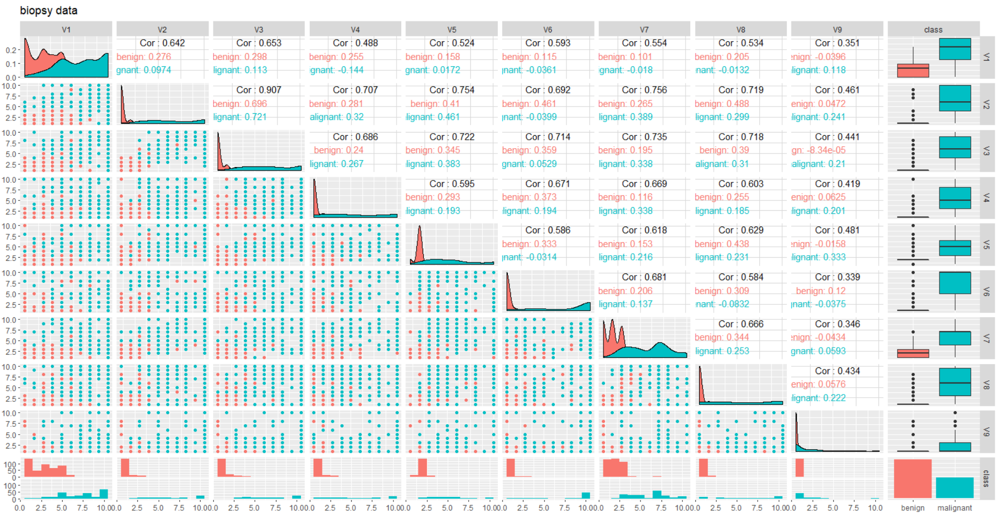

# biopsy Data Description & Question

* biopsy data is breast cancer data

* 10 variables with 683 observations 

* Vi to V9 is predictor varaibles, scaled from 1 to 10

* response variable is "class", it's binary variable with "benign" and "maglinant" levels

* find a suitable model which can be effeciently and correctly classified patients into right class for future diagnosis.

---

# Correlation plot 



---

# Techniques Used

* ramdomly split daat into 2 groups, 75% of observations as traning data, the other 25% as test data 

* do the random split 10 times for each method

* methods used in this report

 + tree
 
 + bagging
 
 + random forrest
 
 + boosting 
 
 + model based classification: teigen
 
 + QDA with PCA 

---

# Overall Results

* for saving time only show all models' efficacy measure by ARI 

```{r echo=FALSE,message=FALSE,warning=FALSE}
library(readr)
library(knitr)
library(kableExtra)

table<-read_csv("comp_table.csv")
table<-table[,-1]
kable(table,"html",caption = "overall ARI result for each method")%>%
  kable_styling(bootstrap_options = c("striped", "hover", "condensed", "responsive"),full_width = F)
```

---


# Plot

* table is hard to capture information, so use plot

```{r echo=FALSE,message=FALSE,warning=FALSE}
library(tidyverse)
library(plotly)
library(directlabels)
df<-read_csv("plot_data.csv")
df<-df[,-1]
p1<-ggplot(df,aes(x=ARI,y=class,color=class))
p2<-(p1
    +geom_line()
    +geom_point()
)

ggplotly(p2)
```


---

# boxplot 

* one more plot, boxplot

```{r echo=FALSE,message=FALSE,warning=FALSE}
bp<-ggplot(df,aes(x=class,y=ARI,color=class))
bp1<-(bp+geom_boxplot()
       )

ggplotly(bp1)
```


---


