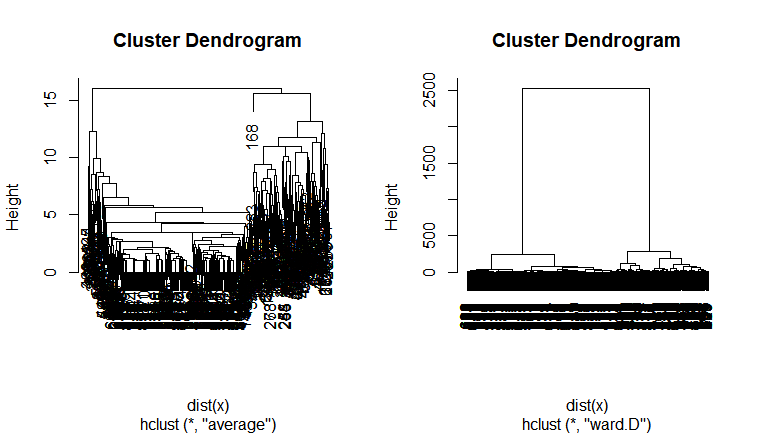
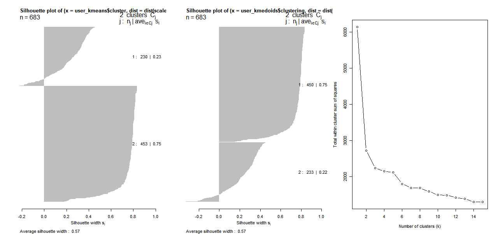

# Data Description & Question addressed

The data set used is called "biopsy" which can be found at **MASS** package in R. It is a breast cancer data, the data assessed biopsies of breast tumours. Data "biopsy" contains 699 observations with 11 variables in total with some NA value, then omit those row which contains NA value. First variable is patients' ID number, dropping column ID since it has no help for cluster  analysis. The rest nine out ten variables are predictor variables, they were scored on a scale from 1 to 10, namely: V1 is clump thinkness, V2 is uniformity of cell size, V3 is uniformity of cell shape, V4 is marginal adhesion, V5 single epithelial cell size, V6 is single epithelial cell size, V7 is bland chromatin, V8 is normal nucleoli, and V9 is mitoses. The response variable is called "class" which is binary result class contain "begin" with 444 patients and "maglinant" with 239 patients. \par

In this analysis report, agglomerative hierarchical clustering, k-means & k-medoids clustering and model based clustering are using for building cluster. The goal is finding a clustering method with best performance capability. First is building cluster based on predictor variables of data, then validating the results from clustering with actual response from the data.  Finally, a comparison table which contains error rate, RI and ARI. \par

# Three method of Clustering & Comparison
For hierarchical clustering, use agglomerative (bottom to top) hierarchical clustering. There are multiple linkage can be chosen, "single", "complete", "average", and "ward D" which used for decide how close two cluster is. Among those 4 linkages, "average" and "ward.D" give tidier and better dendrogram than other two, and their cluster Dendrogram shown at Fig 1. However, the comparison table also include the results from "single" and "complete" linkage. Based on results from dendrogram, cut the tree into 2 cluster and make a table with actual response variable "class", results is Table 1. We can see result of "single" linkage is not good, group 2 does not belong to any class. The best one is "ward.D" linkage, group 1 is class "begin", group 2 is class "malignant". \par

{width=40%}

\begin{table}[h]
\centering
\caption{Hierarchical clustering results from different linkage}
\label{my-label}
\begin{tabular}{|lll|lll|lll|lll|}
\hline
single    & 1   & 2 & complete  & 1   & 2   & average   & 1   & 2   & ward.D    & 1   & 2   \\
begin     & 448 & 0 & begin     & 441 & 3   & begin     & 436 & 8   & begin     & 420 & 24  \\
malignant & 238 & 1 & malignant & 75  & 164 & malignant & 31  & 208 & malignant & 1   & 238 \\ \hline
\end{tabular}
\end{table}

Next, move to $k$-means and $k$-mediods clustering. The first two step for $k$-means and $k$-mediods clustering are pre-specified the number of clusters, and scale the predictors variables. Setting pre-specified number of cluster equals 2, because from earlier hierarchical clustering indicates 2 may be good choice, also I know there is 2 groups for response variable. Moreover, elbow plot from later provides 2 cluster is good choice. Then back to $k$-means and $k$-mediods clustering results, $k$-mediods clustering performs better than $k$-means one. The results table is Table 2. For $k$-means clustering, group 1 is class "maglinant", group 2 is class "begin". For $k$-mediods clustering, group 1 is class "begin", group 2 is class "malignant".  

\begin{table}[h]
\centering
\caption{$k$-means \& $k$-mediods clustering results table}
\label{my-label}
\begin{tabular}{|lll|lll|}
\hline
$k$-means   & 1   & 2   & $k$-mediods & 1   & 2   \\
begin     & 10  & 434 & begin     & 435 & 9   \\
malignant & 220 & 19  & malignant & 15  & 224 \\ \hline
\end{tabular}
\end{table}

Also, silhouette plot is diagnostic plots revealing the goodness of a partition. Higher silhouette values indicates better cluster separating, also more complete the shadow indicates more defined the cluster. Both methods has average silhouette width is 0.57, and their shadows are similar. Elbow plot provides suggestion of clusters, in this case total sum of squares declines dramatically after 2 clusters.All three plots are all shown as Fig 2 (Formatting them together for saving space). 

{width=50%}

As for model based clustering for **GPCM** family. using **Mclust** suggests VEV shape with 7 components, and BIC is -14276.71 under defaults **G** setting is 1:9, where **G** is the number of mixture components (clusters) for which the BIC is to be calculated. Only second and fifth groups are class "malignant", all other groups are class "begin" based on the results. There is no place for BIC and classification plots, also the classification plot for nine variables is messy, so I decide to archive them for saving pages. Then doing clustering by specifying **G** equals to 2:2, and **Mclust** suggests VEV shape as well with BIC is -18132.47. Again, results table shown as Table 3. 

\begin{table}[h]
\centering
\caption{Model based Clustering}
\label{my-label}
\begin{tabular}{|llllllll|lll|}
\hline
G as default & 1   & 2   & 3  & 4  & 5  & 6  & 7  & G=2:2     & 1   & 2   \\
begin        & 139 & 50  & 71 & 81 & 7  & 59 & 37 & begin     & 344 & 100 \\
malignant    & 0   & 151 & 0  & 0  & 84 & 4  & 0  & malignant & 0   & 239 \\ \hline
\end{tabular}
\end{table}

At the end, Table 4 is comparison table for all methods are calculating by **e1071:classAgreement**, includes error rate (ER), rand index (RI) and ARI. We can see the best result is $k$-mediods clustering, it has distinguished lower error rate and higher rand index and ARI. Also hierarchical clustering with "ward.D" linkage is good as well, slightly higher error rate, and slightly lower RI and ARI than $k$-mediods'clustering. In conclusion, both $k$-mediods clustering and hierarchical clustering with "ward.D" linkage give acceptable results of clustering.   

\begin{table}[h]
\centering
\caption{All methods' comparison table}
\label{my-label}
\begin{tabular}{|l|llll|ll|ll|lll}
\cline{1-9}
           & single & complete & average & ward.D & $k$-means & $k$-mediods & Mc: G=2:2 & default G &  &  &  \\
ER & 0.348  & 0.114    & 0.0571  & 0.0367 & 0.0425  & 0.0351    & 0.146         & 0.5755            &  &  &  \\
RI & 0.545  & 0.797    & 0.892   & 0.929  & 0.918   & 0.932     & 0.750         & 0.565             &  &  &  \\
ARI        & 0.0025 & 0.585    & 0.781   & 0.858  & 0.835   & 0.862     & 0.500         & 0.176             &  &  &  \\ \cline{1-9}
\end{tabular}
\end{table}